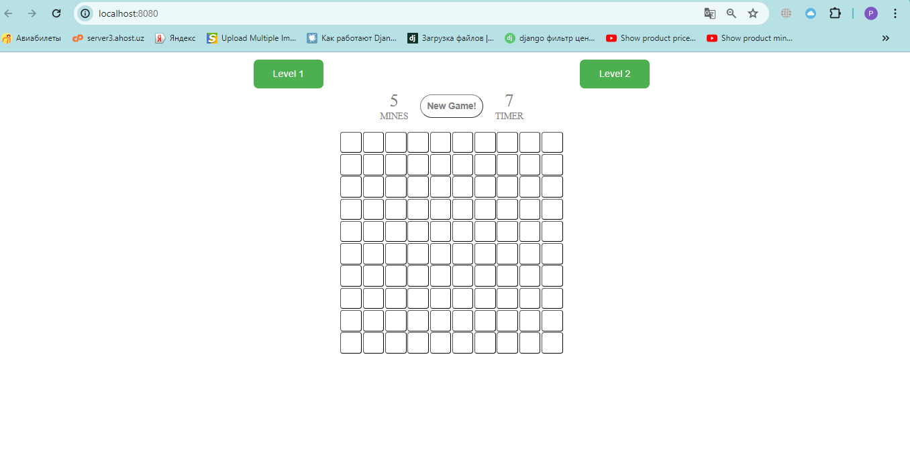

# Minesweeper Typescript

A minesweeper game written in typescript. You can read [here](<https://en.wikipedia.org/wiki/Minesweeper_(video_game)>) for more information about minesweeper game.

# Prerequisites

Before running this project, you will need:
Node.js installed on your system. This project was developed with Node.js version 20.11.0. You can download it from nodejs.org.

## Here is screenshot of the game



#### Installation

Clone the repository to your local machine, then run the following command in the project directory to install the necessary dependencies:

```sh
npm install
```

### Running development server

To start the development server and play the game in a browser, run:

```sh
npm run dev
```

This command will bundle the TypeScript files and assets using Webpack and serve them on a local web server. By default, the server can be accessed at http://localhost:8080. The command also watches for any changes in the source files and automatically rebuilds the project.

## Build For Production

To create a production-ready build of the game, run:

```sh
npm run build
```

This command will optimize and minimize your code for the best performance in production environments. The output will be stored in the dist directory within your project folder.

## Running in the Browser

After starting the development server or building the project, open your web browser and navigate to http://localhost:8080 to start playing the game. Ensure that JavaScript is enabled in your browser.

## Troubleshooting

If you encounter issues running the development server or the game does not load in the browser as expected, please verify the following:

Node.js is properly installed and the node command is available in your terminal or command prompt.
All npm dependencies were installed without errors. If there are errors during installation, consider running npm install again or check your network settings.
The port 8080 is not being used by another service. If it is, you can configure Webpack to use a different port by modifying the Webpack configuration file.

**Roman Kolesov 2024**
